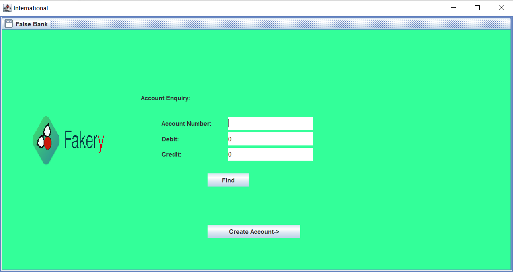

<h1>Banking Application &nbsp;  </h1>

---

This is a simple banking in java using swing library.

#### Libraries required
* swing

#### Note
* The Information is stored in Json file.
* Default password is `123`

##### To clone this repository

> git clone https://github.com/reach-the-sky/Java-Banking-Application.git

If you liked my project and appreciate the content I opensource, consider following me on github [🌥](https://github.com/reach-the-sky).

